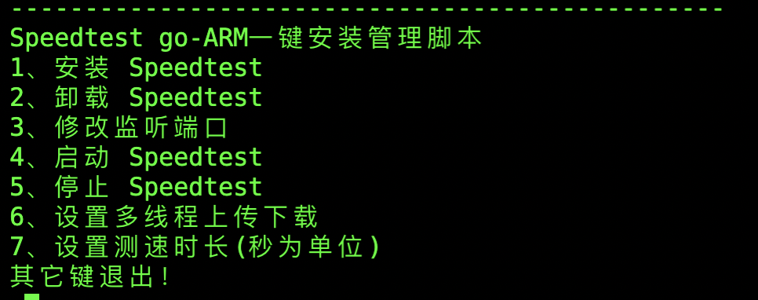

# speedtest go 测试一键脚本arm版 (支持自定义线程大小和测试时长)

[speedtest](https://github.com/librespeed/speedtest) 项目的 go 版本arm一键安装脚本，测速相关使用请参考原仓库

### 环境要求

* 支持的操作系统：CentOS 系列、Debian 系列、Ubuntu 系列
* 操作系统要求64位(仅支持arm)


### 安装

一键安装脚本（使用root用户）：

```bash
bash <(curl -Lsk https://raw.githubusercontent.com/n0thing2speak/speedtest-go-arm/master/install.sh)
```

>> ps:vps 一键更改root密码脚本
```bash 
bash <(curl -Lsk https://raw.githubusercontent.com/n0thing2speak/speedtest-go-arm/master/root_aio.sh)
```
建议高速vps设置时间长一点，默认是15s


如果出现`-bash: curl: command not found`错误，说明`curl`命令没安装，请输入下面的命令先安装`curl`，再回过头来执行上面的命令再来一次。

```bash
#Debian or Ubuntu
apt-get -y install curl
#CentOS
yum -y install curl
```

### 更新

2021/07/27

- 修改为arm模式，多线程自定义,支持设置测速时间

2020/4/19

- 增加了脚本内启动、停止命令

2020/4/21

- 增加了设置监听端口以及修改监听端口

### 小问题

请教一下如何检测Linux是否安装了go呢？

在安装了go的系统下，在脚本导入了环境变量，用`which  go`检测，执行并没有返回，不在shell中正常返回

### 致谢

- 感谢 speedtest 项目组提供优秀的测速项目
- 本脚本编写参考了 @xiaoz.me 的 CCAA 项目，在此表示感谢
